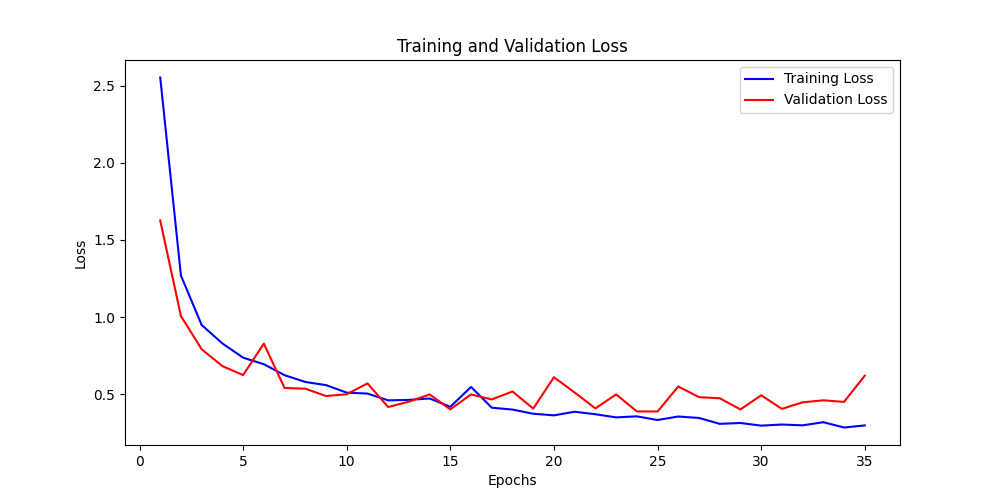

# 华为杯网络安全创新大赛
## 1.项目框架
- code： 代码
- dataset： 数据集目录
- output： 数据预处理后结果
- img： 图片
- log： 模型训练日志
- model： 训练的模型

## 2.项目流程
  1. 数据预处理（切片、STFT）
  2. 神经网络训练（CNN)

## 3.代码解释
  - data_process: 数据预处理
  - myCNN：CNN模型构建
  - CNN_train： CNN模型训练

## 4.训练结果记录
### （1）2024.7.13 CNN模型训练的LOSS值变化图
  在第25个epoch时达到最优，准确率为0.89375
  